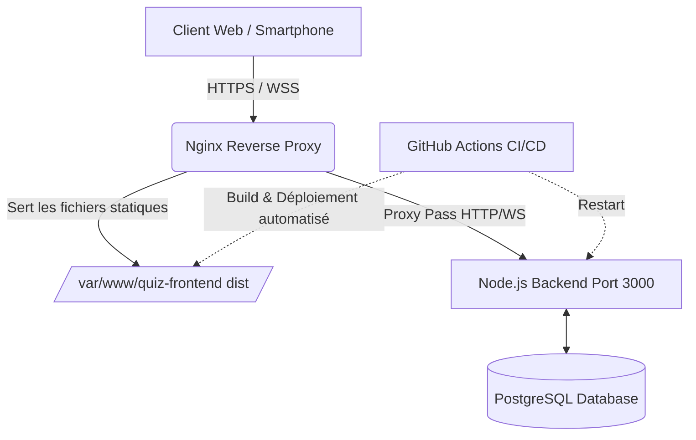

# Rapport de Projet - Quiz Absurde 
## 1. Pitch de l'application 
Le **Quiz Absurde** est une plateforme web full-stack interactive qui permet la création et la participation à des quizs en temps réel.
Mais contrairement aux quizs habituels, celui-ci se démarque par l'intégration de mécaniques de jeu "absurdes" visant à déstabiliser les joueurs : boutons de réponses fuyants sur les écrans, effets sonores immersifs et décalés, apparition de boutons de triche ou de "Rage Quit", et un système de points impitoyable. 
L'objectif est de transformer une simple évaluation de connaissances en une expérience multijoueur chaotique et mémorable. 

---
## 2. Refactoring Initial 
**Choix du code de base :**
Pour pouvoir démarrer le projet de groupe, nous avons décidé de conserver et de faire évoluer la base de code initiale développée par **Justin**.
Nous avons fait ce choix car l'architecture de base qu'il a écrit proposait une séparation claire entre le client et le serveur, facilitant ainsi la future intégration des WebSockets.

**Difficultés d'adoption pour l'autre membre du groupe :**
L'adoption de cette base pour l'autre membre du groupe a soulevé plusieurs défis techniques : 
- **La rigueur de TypeScript :** Le passage à un mode TypeScript strict a nécessité un temps d'adaptation, notamment pour le typage dynamique des payloads de l'API et des événement Socket.
- **L'asynchronisme et la Composition API (Vue 3) :** Comprendre le cycle de vie des composants Vue et gérer la réactivité (`ref`,`computed`) avec en plus les écouteurs Web Sockets nécessitait une gymnastique mentale différente de l'approche par options classique.
- **La logique temps réel :** Il a fallu s'approprier le flux de données bidirectionnel (client-serveur-client) imposé par Socket.io, qui diffère grandement des simples requêtes HTTP REST habituelles. 

--- 
## 3. Infrastructure de Déploiement 
L'infrastructure de déploiement repose sur un Sever Privé Virtuel (VPS) hébergé pour l'EPHEC (`l1-10.ephec-ti.be`)

- **Nginx (Reverse Proxy)** : Est directement installé sur le VPS, il permet de gérer la sécurité avec SSL/TLS (Certboot). Il permet également de servir les fichiers statiques du frontend (via le dossier `dist` généré par Vite), il agit également comme proxy inverser pour rediriger le trafic `/api/` et l'Upgrade WebSocket `/socket.io` vers le backend. 
- **Backend Node.js & Docker** : L'API et le serveur Socket.io tourent en tâche de fond sur le port `3000` du serveur, connectés à la base de donnée **PostgreSQL**
- **GitHub Actions :** Nous l'avons utilisé pour automatiser l'intégration continue. Avec ça quand il y'a un push sur la branche principal, les tests sont automatiquement exécutés. C'est ensuite le pipeline qui s'occupe de la compilation (Build) du code et de son déploiement sur le serveur.
---
## 4. Design Patterns Utilisés
Afin de garantir un code propre, maintenable et évolutif, nous avons implémenté plusieurs patrons de conception : 
1. **Observer (Publish-Subscribe) :** 
	- **Où :** Dans toute la logique de jeu en temps réel (via `Socket.io`)
	- **Pourquoi :** Car le backend émet des événements (`next_question_ready`, `results_revealed`) et tous les clients connectés au même "roomCode" réagissent simultanément à ces changements d'État sans avoir à interroger le serveur en boucle. 
2. **MVC (Model-View-Controller) :** 
	- **Où :** Dans l'architecture globale de l'application, particulièrement visible sur le Backend. 
	- **Pourquoi :** Afin d'avoir une architecture cohérente et séparer la logique métier. Les **Modèles** (ex : `user.model.ts`, gérés via Sequelize) interagissent avec la base de données. Les **Contrôleurs** (`auth.controller.ts`,`category.controller.ts`) contiennent la logique métier, et les **Vues** (le Fontend Vue.js) se chargent de l'affichage.
3. **Singleton :**
	- **Où :** Pour le gestionnaire audio (`audioManager.ts`) sur le frontend et la connexion à la base de données sur le backend. 
	- **Pourquoi :** Pour s'assurer qu'il n'y ait pas qu'une seule et unique instance de ces services qui tourent en mémoire globale. Cela permet d'éviter que plusieurs pistes audio absurde se chevauchent de manière incontrôlable ou que le serveur n'ouvre trop de connexions simultanées à PostgreSQL. 
---
## 5. Couverture de Test (Coverage)
On a assuré la qualité du code de notre API avec l'aide des tests unitaires (Jest). Nous avons validé la solidité de nos contrôleurs critiques (Authentification, Questions, Catégories) en gérant spécifiquement les cas d'erreur de base de données et les suppressions en cascade.

![[Resultat_test_cover]](Resultat_test_cover.png)
